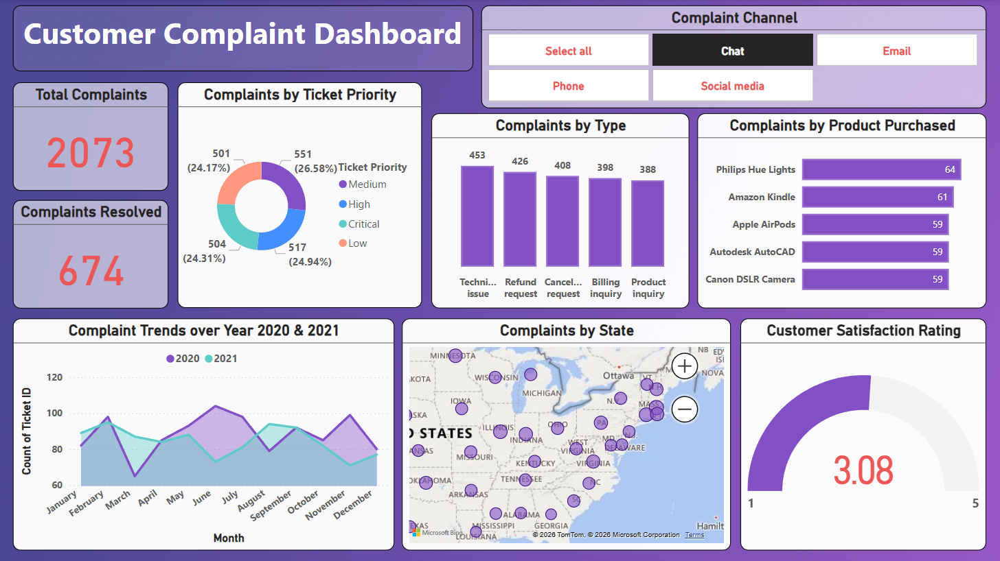
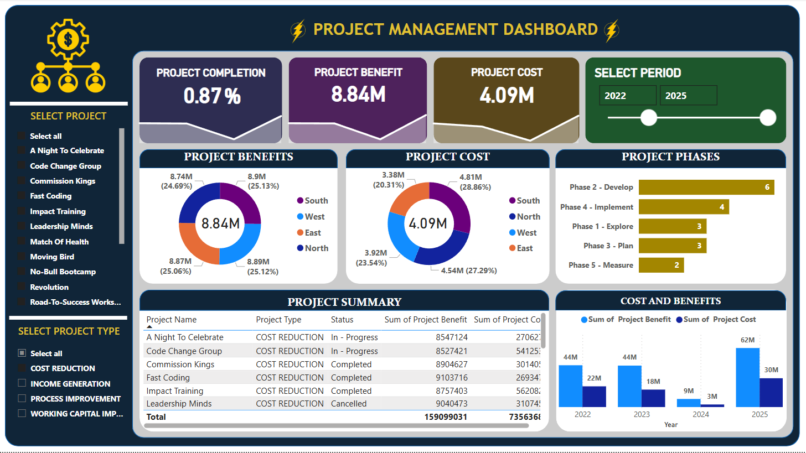
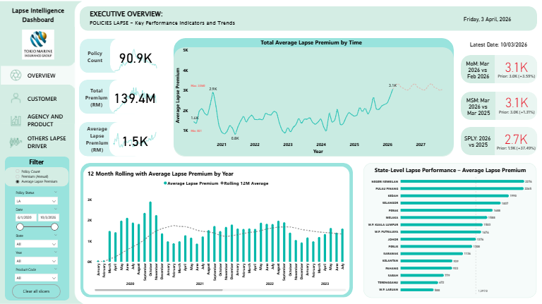

<p align="center">
  
  
  
</p>

# 📊 Power BI Dashboard Portfolio

A collection of interactive Power BI dashboards built for data-driven decision making. Each dashboard demonstrates different analytical approaches — from customer service analytics to project portfolio management and insurance policy monitoring.

---

## 🗂️ Dashboards Overview

### 1. 🛡️ Customer Complaint Dashboard

> **File:** `Customer Complaint Dashboard.pbix`



#### What It's About
This dashboard provides a **comprehensive view of customer complaint management** across multiple service channels. It helps support teams and management identify complaint patterns, prioritize resolution efforts, and monitor customer satisfaction in real-time.

#### Key Metrics & Visuals
| Component | Description |
|---|---|
| **Total Complaints** | Overall complaint count — **2,073** tickets tracked |
| **Complaints Resolved** | Number of successfully resolved cases — **674** |
| **Complaints by Ticket Priority** | Donut chart breaking down tickets by severity: Critical, High, Medium, and Low |
| **Complaints by Type** | Bar chart showing categories: Technical Issue (453), Refund Request (426), Cancellation Request (408), Billing Inquiry (398), Product Inquiry (388) |
| **Complaints by Product Purchased** | Horizontal bar chart highlighting top products with most complaints: Philips Hue Lights (64), Amazon Kindle (61), Apple AirPods (59), Autodesk AutoCAD (59), Canon DSLR Camera (59) |
| **Complaint Channel Filter** | Interactive slicer to filter by channel: Chat, Email, Phone, Social Media |
| **Complaint Trends (2020 & 2021)** | Line chart comparing monthly complaint volumes year-over-year |
| **Complaints by State** | Geographic map visualizing complaint distribution across US states |
| **Customer Satisfaction Rating** | Gauge chart showing average rating — **3.08 / 5** |

#### Insights
- Ticket priority is evenly distributed (~24-26% each), suggesting no single severity dominates
- Technical issues are the leading complaint type
- Customer satisfaction sits at 3.08 — below the midpoint of 3.5, indicating room for improvement
- Complaint volumes show seasonal fluctuation with peaks mid-year

---

### 2. ⚡ Project Management Dashboard

> **File:** `Project Management Dashboard.pbix`



#### What It's About
This dashboard serves as a **project portfolio command center** for tracking project performance, costs, and benefits across multiple initiatives. It enables project managers and executives to monitor completion rates, compare cost vs. benefit by region, and assess project phases — all within a selected time period.

#### Key Metrics & Visuals
| Component | Description |
|---|---|
| **Project Completion** | Overall completion rate — **0.87%** (early-stage portfolio) |
| **Project Benefit** | Total aggregated benefit value — **8.84M** |
| **Project Cost** | Total aggregated project cost — **4.09M** |
| **Select Period** | Interactive slider to filter data between **2022–2025** |
| **Project Benefits (by Region)** | Donut chart: South (8.74M), West (8.9M), East (8.89M), North (8.87M) |
| **Project Cost (by Region)** | Donut chart: South (3.38M), North (4.54M), West (3.92M), East (4.81M) |
| **Project Phases** | Horizontal bar chart: Develop (6), Implement (4), Explore (3), Plan (3), Measure (2) |
| **Project Summary Table** | Detailed table with Name, Type, Status, Benefit, and Cost per project |
| **Cost and Benefits (by Year)** | Clustered bar chart comparing annual benefit vs. cost from 2022–2025 |
| **Select Project / Project Type** | Left-panel filters for individual projects and types: Cost Reduction, Income Generation, Process Improvement, Working Capital Improvement |

#### Insights
- The portfolio has a healthy **2.16:1 benefit-to-cost ratio** (8.84M benefit vs. 4.09M cost)
- Benefits are evenly distributed across regions (~25% each)
- "Develop" phase has the most active projects, suggesting strong pipeline activity
- Project types span across Cost Reduction, Income Generation, Process Improvement, and Working Capital Improvement
- 2025 shows a significant spike in both cost (30M) and benefit (62M)

---

### 3. 📋 Reinstatement Policy Holders — Lapse Intelligence Dashboard

> **File:** *(Power BI file not included — screenshot only)*



#### What It's About
This dashboard is a **Lapse Intelligence tool for Insurance Group**, designed to monitor and analyze insurance policy lapses. It provides executives with key performance indicators on lapse premiums, trends over time, and state-level performance — enabling targeted retention strategies.

#### Key Metrics & Visuals
| Component | Description |
|---|---|
| **Policy Count** | Total policies tracked — **90.9K** |
| **Total Premium (RM)** | Combined premium value — **139.4M** (Malaysian Ringgit) |
| **Average Lapse Premium (RM)** | Average premium at lapse — **1.5K** |
| **Total Average Lapse Premium by Time** | Line chart showing lapse premium trends from 2021 to 2027 with notable peaks and a recent uptick at **3.1K** |
| **MoM (Month-over-Month)** | Mar 2026 vs Feb 2026 — **3.1K** (Prior: 3.0K, +3.59%) |
| **MSM (Month-Same-Month)** | Mar 2026 vs Mar 2025 — **3.1K** (Prior: 3.0K, +1.11%) |
| **SPLY (Same Period Last Year)** | 2026 vs 2025 — **2.7K** (Prior: 1.6K, +31.45%) |
| **12-Month Rolling Average** | Area chart with rolling average overlaid against monthly premiums from 2020–2022 |
| **State-Level Lapse Performance** | Horizontal bar chart ranking Malaysian states — Negeri Sembilan leads at **2,275**, followed by Pulau Pinang and Kedah |
| **Filters** | Policy Status, Date Range, State, Year, and Product Code slicers |
| **Navigation** | Sidebar with sections: Overview, Customer, Agency and Product, Others Lapse Driver |

#### Insights
- Lapse premiums have been trending upward since mid-2024, reaching 3.1K — a **31.45% YoY increase**
- Negeri Sembilan has the highest average lapse premium, warranting focused retention efforts
- The dashboard supports multi-dimensional filtering for deep-dive analysis by state, product, and time period
- The executive overview is dated **Friday, 3 April 2026**, with data latest as of **10/03/2026**

---

## 🛠️ Tools & Technologies

- **Microsoft Power BI Desktop** — Dashboard development and data modeling
- **DAX (Data Analysis Expressions)** — Calculated measures and KPIs
- **Power Query (M Language)** — Data transformation and ETL
- **Bing Maps / Microsoft Maps** — Geographic visualizations

## 📁 Repository Structure

```
📦 dashboard/
├── 📄 README.md
├── 📊 Customer Complaint Dashboard.pbix
├── 🖼️ Customer_Complaint_Dashboard.png
├── 📊 Project Management Dashboard.pbix
├── 🖼️ Project_Management_Dashboard.png
└── 🖼️ Reinstatement_Policy_Holders_Dashboard.png
```

## 🚀 How to Use

1. **Clone** this repository
   ```bash
   git clone https://github.com/azrulzulhilmi/MyPowerBI_Dashboard.git
   ```
2. **Open** the `.pbix` files in [Power BI Desktop](https://powerbi.microsoft.com/desktop/)
3. **Interact** with the slicers, filters, and visuals to explore the data

> **Note:** Some dashboards may require reconnecting to their original data sources. Sample data is embedded where available.

## 👤 Author

**Azrul Zulhilmi**  
📧 [azrulzulhilmi@users.noreply.github.com](mailto:azrulzulhilmi00@gmail.com)  
🔗 [GitHub Profile](https://github.com/azrulzulhilmi)

---

<p align="center">
  <i>Built with 💡 data storytelling and Power BI</i>
</p>
